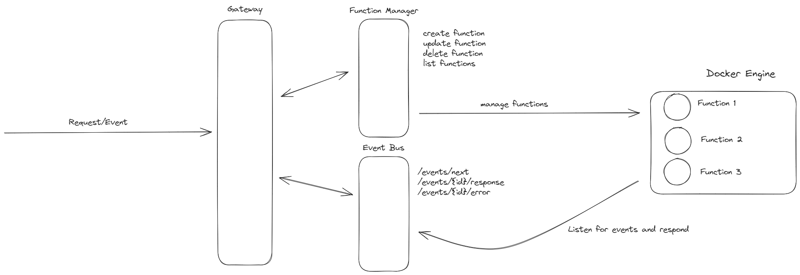

# yafaas (yet another function as a service)

The purpose of the yafaas is to show how a function as a service could be implemented using docker containers as the underlying sandbox environment and runtime.

This project is not intented to be used as an actual service in production, but I'm not stopping you if you do (not my problem if things don't break!).

## Build

- `npm run build`
- `docker build -t yafaas .`

## Run

- `docker run --rm yafaas`

## Architecture

